### Booleans And Subdivision

> Subdivision is something I use differently in my work compared to before. While it's usually not present in my final product it is used in the blocking process or in times when I want to exponentially multiply the geometry.

# Subdivision Conversion

To start let's make a simple shape.

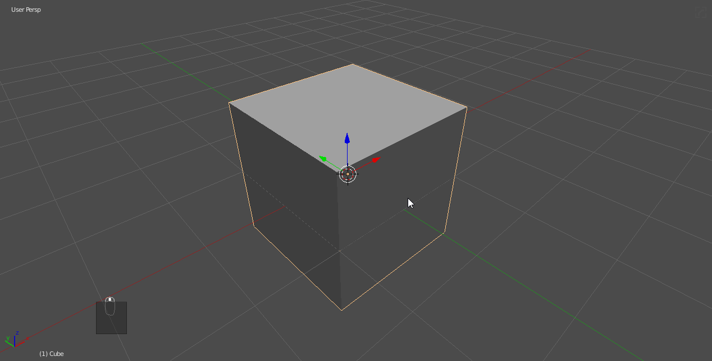

Right now with the [cSharpen](csharpen) the shape has a bevel and all the booleans are applied. If we were to put a subdivision modifier on the mesh it would turn into a mess.

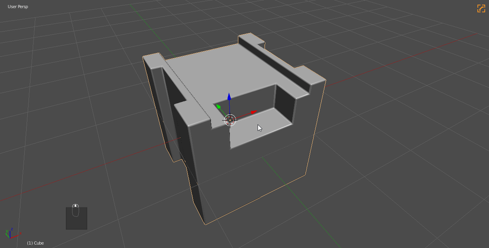

We can hack it into place with a triangulate modifier. It's important to note that subdivision on any level will convert a tri/ngons into quads. So sometimes I work on low and just apply sub-d to convert to quads.

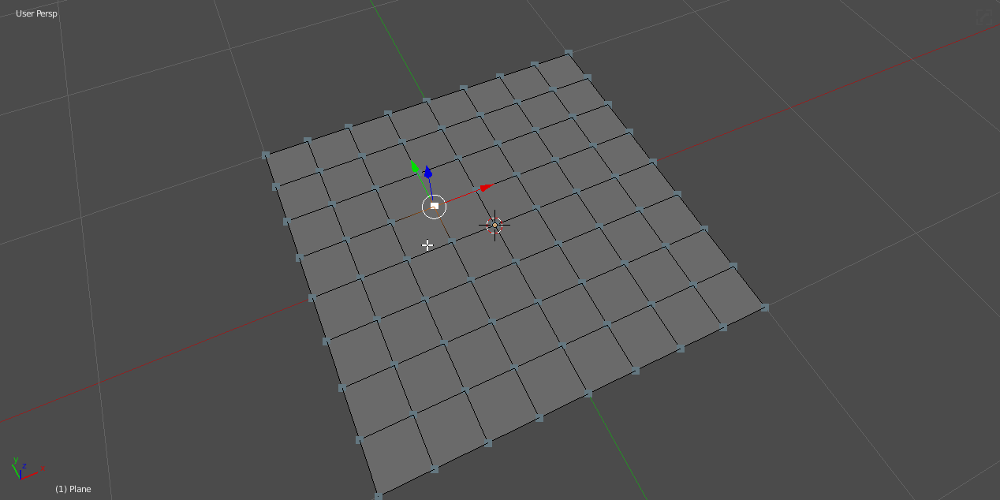

But if we do this to our cube it will compromise our edges.

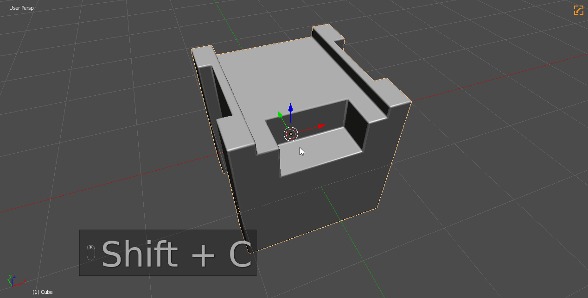

Even raising the segments of the [bWidth](bwidth) will not help this.

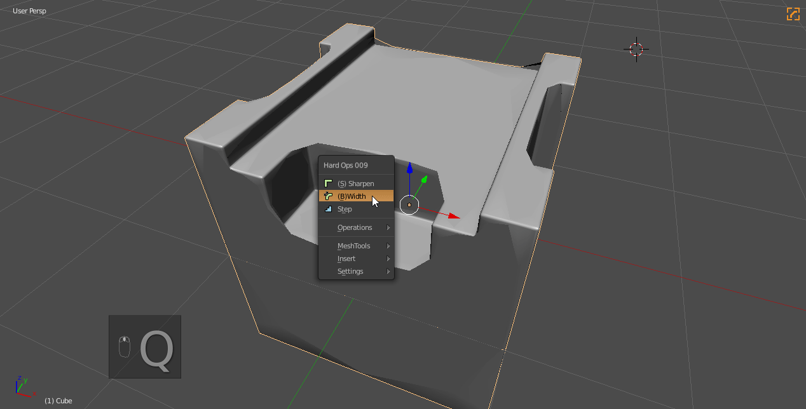

So to truly fix this we will need the bwidth and some manual bevels and insets.
In the below example you can notice the following things:

- pressing Z during [bWidth](bwidth) will show wire
- holding ctrl and raising profile to 1 has turned this into a subdivision type bevel which we will take advantage of
- the spacing has to not has overlap hence it being a small width

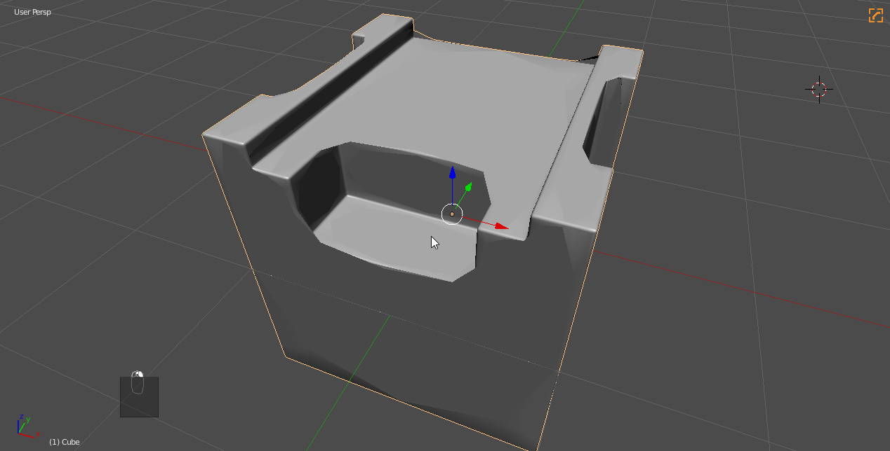

For the next part be on the lookout for the following shape.

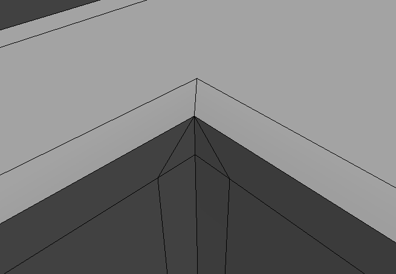

These are the bane of the conversion process and must be handled specifically. Due to the angle these edges must be demoted then beveled using ctrl + b in edit mode. A few notes about using ctrl + b:

- rolling mouse wheel adds segements
- pressing P allows for profile change. 1 is the value needed here
- F6 will allow custom parameters that will determine the default usage of the next call

With this in mind lets correct the shape. Also I will automirror to make my life easier since this form is an example.

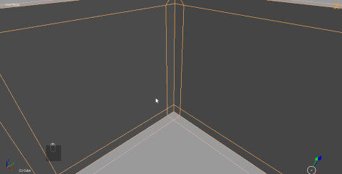

Now the form is set up for us to solve the ngons. The edgework and its edgeflow is the most important thing to me so getting it to flow well no matter what is my goal.

There are tools in Hard Ops for locating ngons and tris which we can use to visually see ngons as they get resolved with the knife.

  - Q >> Settings >> Selection Options >> Display Ngons/Tris

  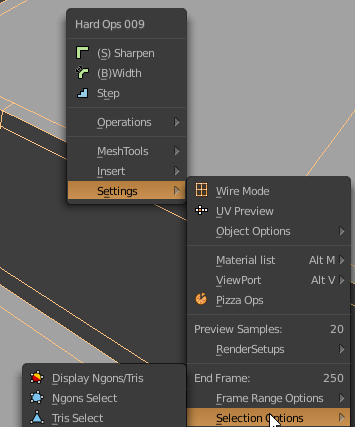

First we will apply the bevel which makes everything real and remove the sharpening.

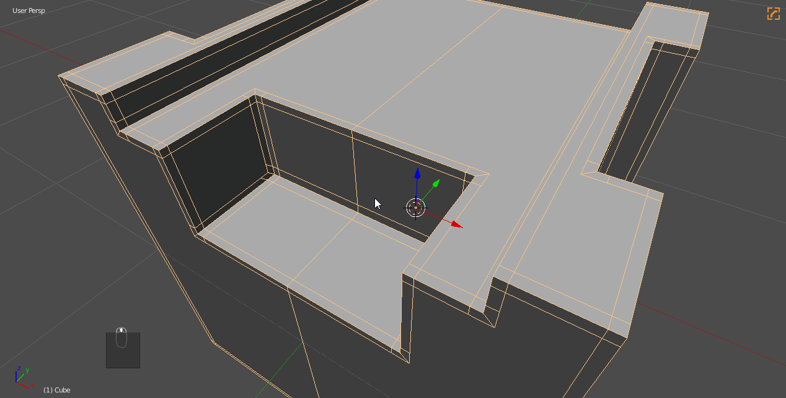

And finally correct everything until red is gone.

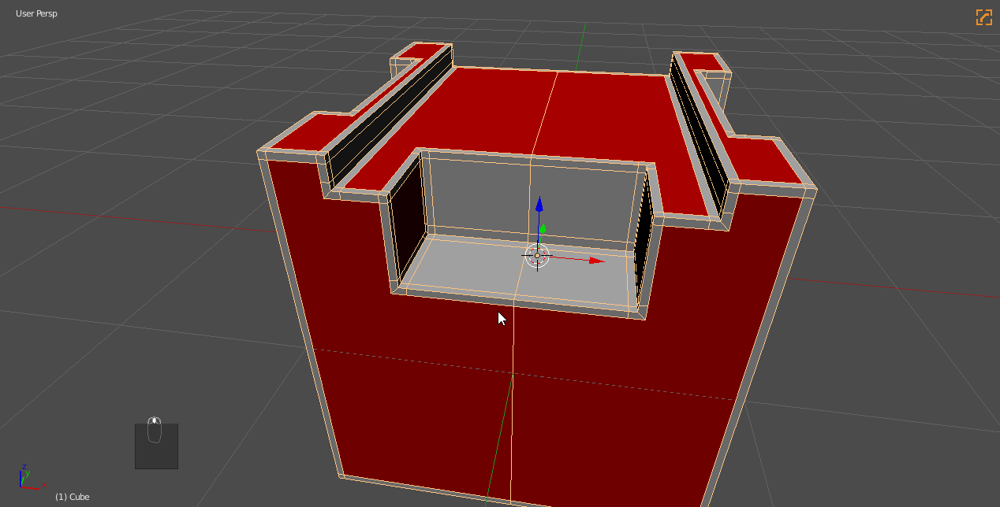

And one more to finish it up.

As you can gather by now this process is not easy or automatic and will be dependant on your skill as a modeller. However all quad workflows are possible. For topology I recommend the following [reading](https://www.pinterest.com/sergicg/topology/?lp=true).

Interestingly enough we can convert this back to a simple hops shape with Q >> Operations >> [Clean Mesh(E)](cleanmesh)

So the final question is can you notice the difference?

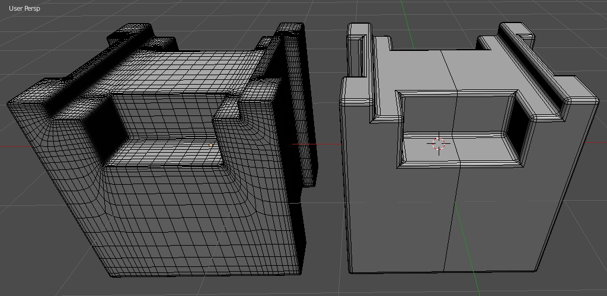

Even after the normals are weighted and the meshes are rendering?

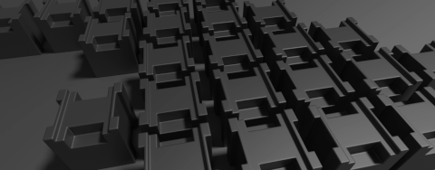

---

## Alternate Uses Of Subdivision

# Cylindrical Rebasing

Sometimes I utilize the sharpening / creasing behavior of ssharpen to level up cylindrical shapes for detail.

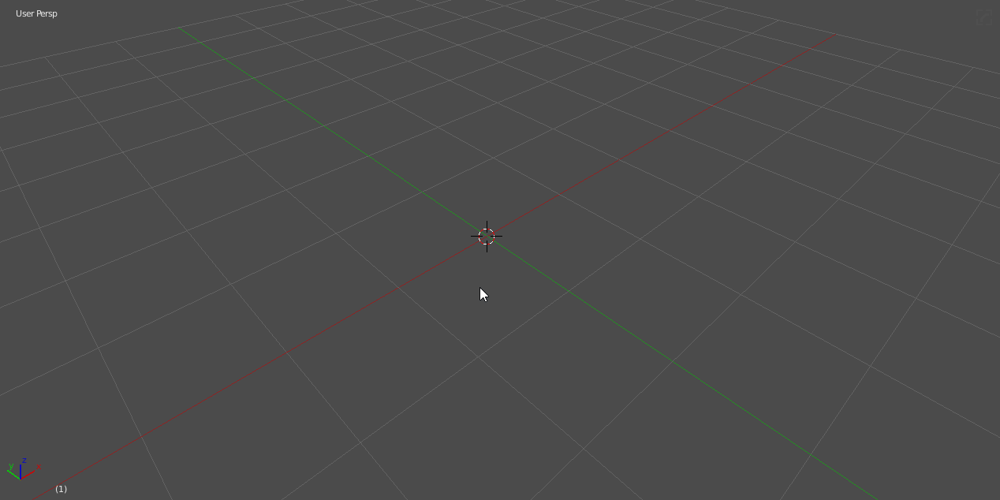

If subdivision is used on default ngon capped cylinder, the shape collapses. It has always driven me crazy. However with a quick ssharpen the edges are creased at the top allowing me to subdivide and convert to mesh to quickly get back into HOPS workflows.

So to quickly show it in action:

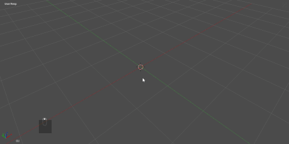

This process is also what we call a rebase. Where the basic form is rounded but the excess spans are removed. Someday we hope to expand on this workflow but for now it is something we experiment with which we figure out automation for the masses.
