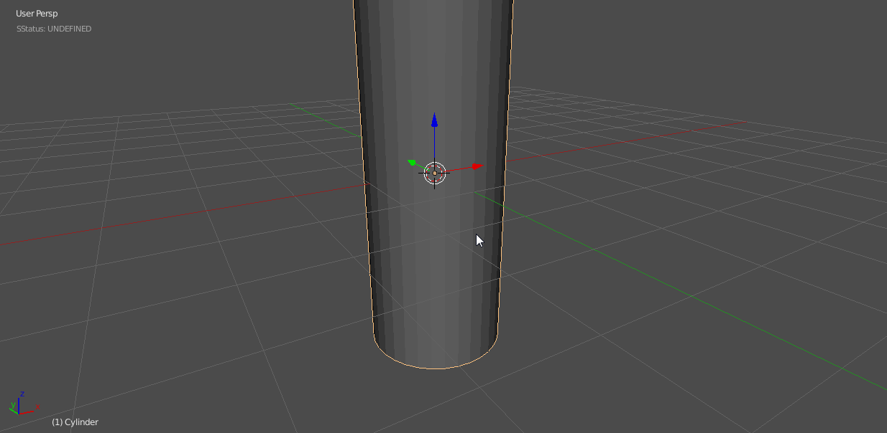

____

# [Booleans](boolean.md) Cleanup

____

# [Booleans](boolean.md) And Curvature

Curvature can be a tricky thing to use with [Boolean](boolean.md)s and to be honest there is no shortcut to efficient geometry however there are some understandings that can make it easier.

> Using a [Boolean](boolean.md) on a cylinder is the same in Hard Ops as it would be with just [Boolean](boolean.md)s alone.

Here I attempt clean it up the lazy way.

As you can see the geometric result was quite bad. This is due to the surfacing / curves ngons and the bevel on top. There are a couple of ways to fix this.

  -adding geometry around the area to isolate the normal shading. Bevel 2 segment w/ profile at 1.

  -removing doubles for double vertices in the same areas while merging near miss vertices

  This can require a small amount of work however we are always looking into ways to improve this.

  The difference between them can be quite immense.

The art of cleanup is an essential one for boolean modelling. I also recommend [meshMachine](https://www.blendermarket.com/products/MESHmachine) to make this aspect of working much easier.

<iframe width="560" height="315" src="https://www.youtube.com/watch?v=C5TknYySBpM" frameborder="0" allowfullscreen></iframe>

___

# Smith and Wesson 76 Submachine Gun Barrel

Some topics aren't worth doing videos on. A gun barrel is one of them. This is another one of those cases where approach is more important than using booleans.

In this example I will start with a plane and twist 360.

While the mods are live adjustments can be made to fix the skewing of the circle.

As more segments are cut in with knife the shape is holding better.

Notice that knife cuts in the circle region will not work due to it affecting the curvature.

When dealing with booleans or holes and curvature the approach is more important than the workflow used. Booleans might seem like a good choice but deformation requires adequate geo to achieve surfacing. So sometimes it is better to approach the creation from a non-destructive perspective to allow for more versatility in the solution.

Boxcutter can be useful as well if you utilize the tools but I feel the hops approach is more precise and gradual.

In the above example I did the following:

- deleted cube
- added plane > moved plane out on Y
- used twist 360 (non-destructive)
- turned off array merge on mod
- converted to mesh
- set origin to geometry
- recentered object
- separated front facing segment
- blue circle edit mode to cut circle into deformed segment
- radial array using 3d cursor in hops

The point is for deformation, care but be taken with planning and execution since linear cuts alone won't cut it.

___

# Pokeball example

A nice demonstration of the inadequacies of [Boolean](boolean.md)s for hard surfaces can be shown in making a pokeball. I did a small study about how it can be done quickly with [Boolean](boolean.md)s versus efficiently with a cast modifier and subdivision blocking.

> [Booleans](boolean.md)

You can see with the surfaces that there is still a little touchup work to be done. However I must say that Hard Ops is not just for booleans it also is a tool for helping get a "finished" result. So now lets try using a cast modifier with subdivision to get the shape more sharper.

> Cast Modifier With Subdivision Blocking

In this example the finishing was done via the Bevel while the initial shape is blocked in using modifiers efficiently and the cast modifier. While this can't work in all cases. It just serves as an example of an alternative way to approach such a shape.
