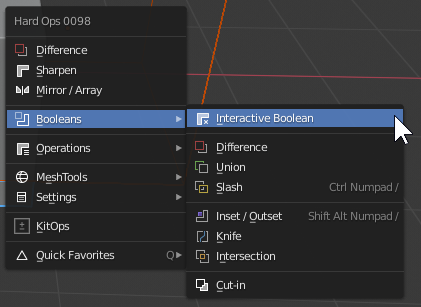
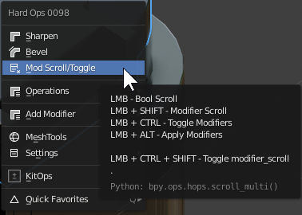
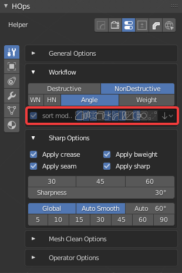
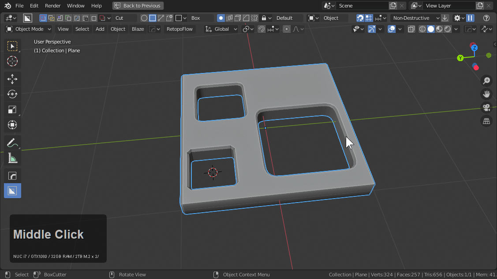
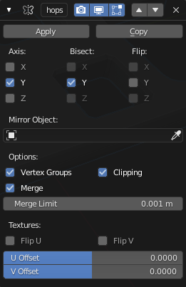
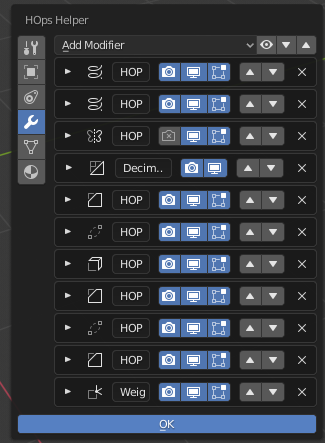
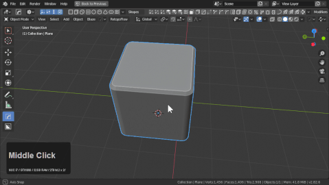
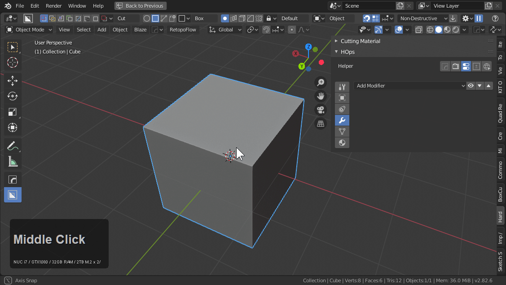
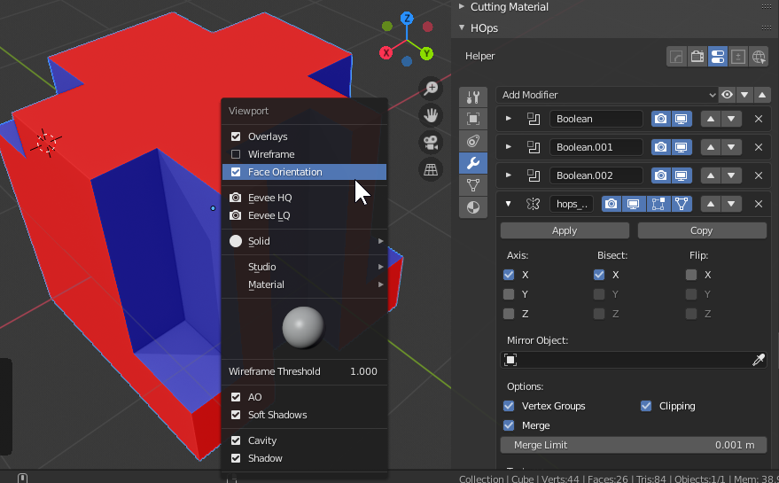

## Hard Ops [Boolean](boolean.md) System

<iframe width="560" height="315" src="https://www.youtube.com/embed/Sd6U4ZFcMyc" frameborder="0" allowfullscreen></iframe>

<iframe width="560" height="315" src="https://www.youtube.com/embed/S6uFpBe1oTU" frameborder="0" allowfullscreen></iframe>

> With 2 meshes selected <kbd>Q</kbd> will bring up the hopsMenu with boolean options.

___

# [Boolean](boolean.md) Basics

> With the Hard Ops 8 update. Booltool is no longer a required dependency. In fact it is recommended to use the new system instead since it's more catered to our own tools. There are also edit mode behaviors now.

**If Booltool is present hardOps not assign our hotkeys.**

The [Boolean](boolean.md) hotkeys are as follows
Object Mode

- Ctrl + Numpad Minus (Difference)
- Ctrl + Numpad Plus (Union)
- Ctrl + Numpad Slash (Slice)
- Alt + Shift + Numpad Slash (Inset)

To show each of them in action.

Edit mode also contains hotkeys:

- Ctrl + Alt + Numpad Minus (Difference)
- Ctrl + Alt + Numpad Plus (Union)

Edit mode booleans are interesting for being destructive but also useful for things like slice and union.

Interactive boolean is a new thing added to 984 and can be used with ctrl + alt + B.

It can also be found in the boolean submenu. (2 object selection)

# Boolean Tips

> These tips are intended to help make the best out of your experience.

We intend for users to enjoy our tool and have an nice experience. [If you are experiencing issues.](issues.md) [***Please tell us.***](contact.md)

We would prefer to discuss and help solve it before you frustrate yourself. Great care and effort has been taken into making hops a community experience with many on hand capable of assisting quickly and proving help when you need it. A single mind can do so much but a collection of minds is infinite. I sleep 3 hours a night to make sure the boxes are always cut with only the finest red.

## scrolls are your friend

The first scroll was a random idea but now scrolling via modals have become crucial for troubleshooting.

> When things go wrong. You get in there and you troubleshoot. It is the only way forward... With each cut solved your understanding of booleans will be deeper and you will be able to work more efficiently with less issues.

LMB - bool scroll (cycles boolean shapes)

If you need a boolshape associated with the selection this is the goto tool. I will sometimes cut and the cut doesn't work out. Then by using this and scrolling back to get the last shape then clicking I am able to rapidly modify shapes and figure out where they went wrong. I would be a liar to say issues don't happen. But we have done our best to put the right tools at your fingertip to keep things running fluidly.

Shift - modifier scroll (scrolls modifiers additively one by one in a stack)

When dealing with modifiers a section of the brain must be allocated to thinking about that stack. We attempted to be that brain with sort. But we still need your awareness when it comes to the stack. By scrolling modifiers users are able to quickly see how the stack got the mesh to its current state. We can't roll undo history so this is the closest thing. This feature has proven to be essential for troubleshooting modifier non destructive workflows.

Ctrl - toggle modifiers

Sometimes you need to just turn all the modifiers off and see the true mesh. I don't use this often. But it exists for the times when it is needed. I like to duplicate things and alter their order to make duplicates that I then apply and move around. Kinda weird to work in this fashion but I want to emphasize this is the functionality and flexibility we aim for.

Scrolls exist at various places in the menu. Initially we had quite a few scrolls but now we seek to consolidate but for those who have a favorite scroll they remain standalone as well so they can be right clicked added to favorites if needed for a specific use.

## work a box . at least once.

Luvin boxes is more than a meme to us. It's a perfect control situation to test cases without the complexity of scene management etc.
Boxes are nothing more than just a way to pop your knuckles. Preparing you for the more complex battles that lie ahead. A common mistake is to take the toolkit directly into a project without a consideration of all the systems at play.

HardOps was intended to show users the best option at the right time and help them get started faster but before that. Try looking at some of the options enabled. Workflow options can be accessed via the ctrl + ~ or the N panel of the 3d view in the HOPS tab.

[If you are not aware of sort or intend to use it, I do not recommend using it.](sorting.md) Otherwise we will make corrections to things you may not want corrected in the mod stack.

have.fun

I want people taking their knowledge [far past boxes](https://www.pinterest.com/masterxeon1001/hard-ops-users/) but let's make sure you know the fundamentals of workflow.

## always have a manifold mesh

Mirror on alt + X offers multiple mirror options.

***Modifier*** is recommended for boolean workflows.

A common mistake is using bisect. This was our only choice back in 2.79 but the new modifier system has changed things. Below is an example of using bisect and having issues with booleans near the middle point. ***Do not use bisect with boolean***

Using modifier as mirror is an immense improvement upon modelling and using booleans. Notice in the below example I am able to apply my bisect mirror and add a subsequent mirror utilizing modifier to get the intended result.

Booleans require manifold geometry. This is a rule and theres no way around it but because it is a rule, it can be counted on for predictability. As in ***I know*** (from experience) cutting on non manifold geometry will make holes. Personally I utilize those limitations into workflows as well as seen below.

Modifier mirror can be used creatively as shown here for mirroring across things without having o contemplate booleans.

If you look at the mirror mod itself users can see how much it has changed in 2.8.

## weld is cool

With smart boxes I recently made some changes in the mod order. 2.82 and up. I bring this up because when two verts sit in the same place boolean issues will occur. Weld follows all the previous bevels except for the last level to make it easier than ever to max and min bevels without issues with shading and geometry.

Utilizing hoptool dots to show this in action. Now the result with merging small bevels is finessed making life easier. For this reason I recommend weld as a support tool when it comes to bevels and doubles. It is not worth saying it's a must for usage but I have found it more useful than ever as time goes on.

Utilizing a support issue as an example. This issue was caused by a mesh fault unseen due to the boolean being a wire shape.

Just doing that for the example makes me want to make weld a modal but I have plans for a tool to assist with troubleshooting based on all the things discussed here.

## when cutting make sure its the right side if utilizing mirror

Sounds basic but its a common thing. Sometimes we make mistakes and oversights and systems we have for other things take over and do unwanted things causing confusion for the user.

## sort awareness

Sort is a work in progress of an idea we had to expand on the non-destructive workflow. Because we attempted to automate it as a machine it can turn against its human masters.

In the above example mirror is used very early in the stack. However this goes against sort rules which when enabled makes the only mirror mod the last mod. In order to maintain the integrity of my stack and work the way I want I had to "bypass sort". This can be done via toggling renderability on an object. I use this for modelling and generally turn it back on when done.

> If you are not aware of sort and work with it in mind it will work against you.

## check that face orientation

Alt + V >> Face Orientation

Face orientation is a troubleshooting tool to me. When it was added to 2.8 I immediately saw the potential.

Having flipped normals can cause boolean issues and make booleans more difficult than they need to be. This can also make boxcutter irritated and function oddly.

> Applying scale can sometimes cause strangeness.

## useful mesh tools

All our tools are just extending on Blender. We just try to be a bridge to you the user in some cases.

Select >> Select Loops >> Select Boundary loop

I use this so much I have it mapped to shift + ~ in edit mode. This comes in handy for ensuring the mesh is manifold.

> Non manifold meshes are cause of most boolean tragedies next most popular being hotlining.

____

# [Booleans](boolean.md) Cleanup

____

# [Booleans](boolean.md) And Curvature

Curvature can be a tricky thing to use with [Boolean](boolean.md)s and to be honest there is no shortcut to efficient geometry however there are some understandings that can make it easier.

> Using a [Boolean](boolean.md) on a cylinder is the same in Hard Ops as it would be with just [Boolean](boolean.md)s alone.

Here I attempt clean it up the lazy way.

As you can see the geometric result was quite bad. This is due to the surfacing / curves ngons and the bevel on top. There are a couple of ways to fix this.

  -adding geometry around the area to isolate the normal shading. Bevel 2 segment w/ profile at 1.

  -removing doubles for double vertices in the same areas while merging near miss vertices

  This can require a small amount of work however we are always looking into ways to improve this.

  The difference between them can be quite immense.

The art of cleanup is an essential one for boolean modelling. I also recommend [meshMachine](https://www.blendermarket.com/products/MESHmachine) to make this aspect of working much easier.

<iframe width="560" height="315" src="https://www.youtube.com/watch?v=C5TknYySBpM" frameborder="0" allowfullscreen></iframe>

___

# Smith and Wesson 76 Submachine Gun Barrel

Some topics aren't worth doing videos on. A gun barrel is one of them. This is another one of those cases where approach is more important than using booleans.

In this example I will start with a plane and twist 360.

While the mods are live adjustments can be made to fix the skewing of the circle.

As more segments are cut in with knife the shape is holding better.

Notice that knife cuts in the circle region will not work due to it affecting the curvature.

When dealing with booleans or holes and curvature the approach is more important than the workflow used. Booleans might seem like a good choice but deformation requires adequate geo to achieve surfacing. So sometimes it is better to approach the creation from a non-destructive perspective to allow for more versatility in the solution.

Boxcutter can be useful as well if you utilize the tools but I feel the hops approach is more precise and gradual.

In the above example I did the following:

- deleted cube
- added plane > moved plane out on Y
- used twist 360 (non-destructive)
- turned off array merge on mod
- converted to mesh
- set origin to geometry
- recentered object
- separated front facing segment
- blue circle edit mode to cut circle into deformed segment
- radial array using 3d cursor in hops

The point is for deformation, care but be taken with planning and execution since linear cuts alone won't cut it.

___

# Pokeball example

A nice demonstration of the inadequacies of [Boolean](boolean.md)s for hard surfaces can be shown in making a pokeball. I did a small study about how it can be done quickly with [Boolean](boolean.md)s versus efficiently with a cast modifier and subdivision blocking.

> [Booleans](boolean.md)

You can see with the surfaces that there is still a little touchup work to be done. However I must say that Hard Ops is not just for booleans it also is a tool for helping get a "finished" result. So now lets try using a cast modifier with subdivision to get the shape more sharper.

> Cast Modifier With Subdivision Blocking

In this example the finishing was done via the Bevel while the initial shape is blocked in using modifiers efficiently and the cast modifier. While this can't work in all cases. It just serves as an example of an alternative way to approach such a shape.
