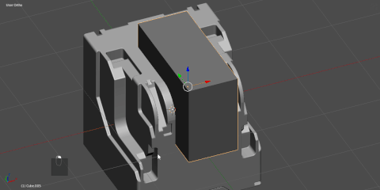
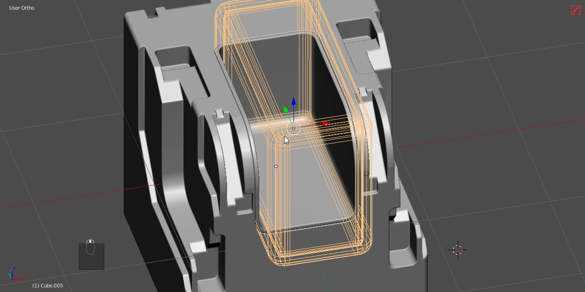
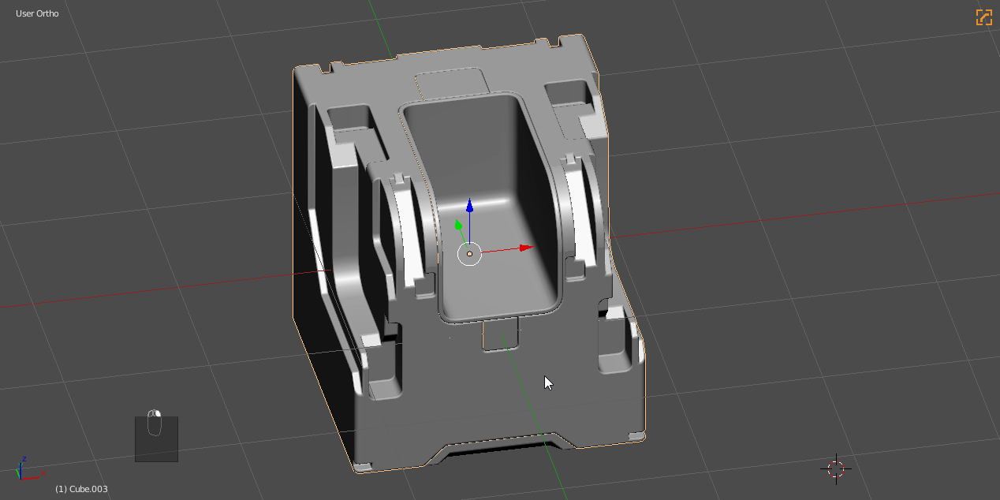
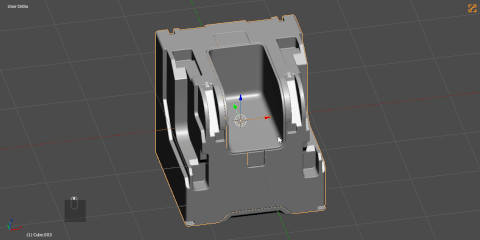
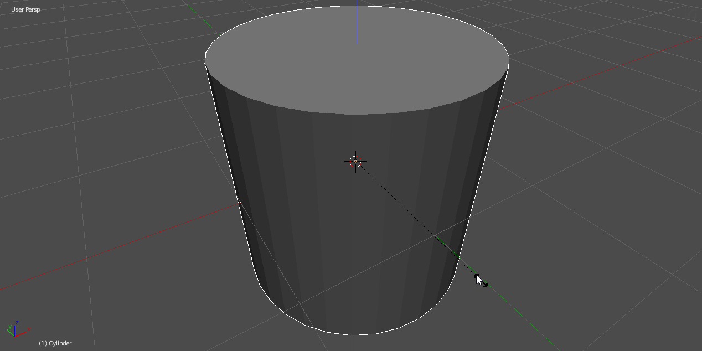
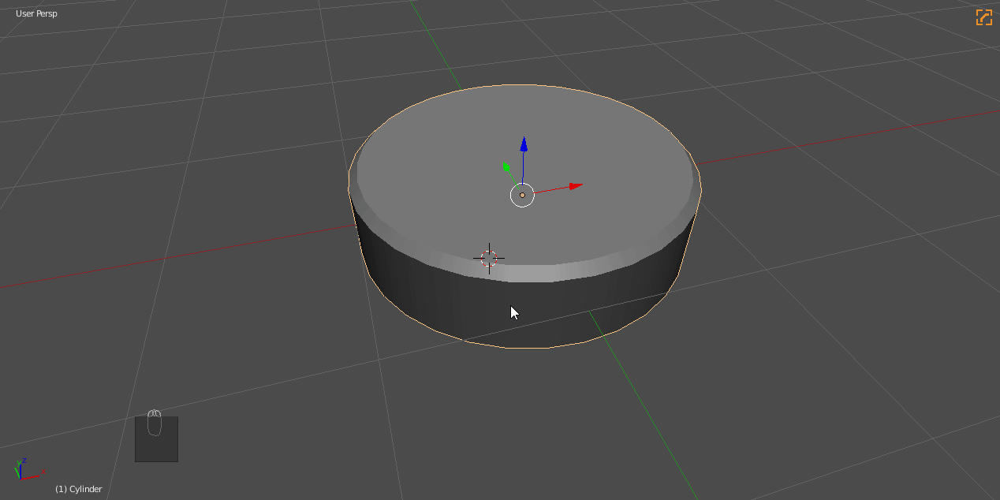
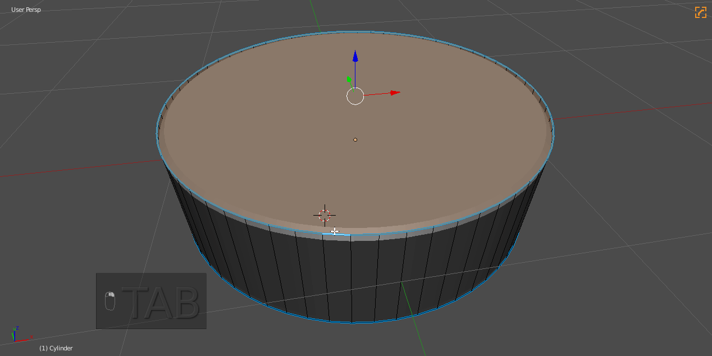
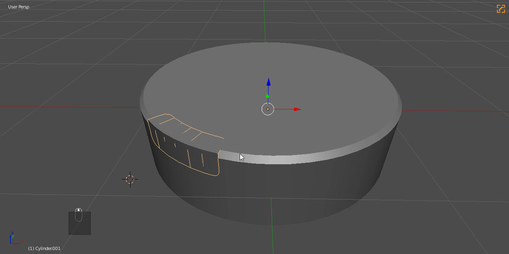

### Boolean Tips

## Boolean Combos

# Example 1 (Boolean / tThick / cSlash )

Below are some examples of how I make shapes using booleans in Hard Ops. It's also important to note that I am modifing the boolshape before csharpening the main form. Otherwise it would be applied.

To discuss this first example:

- subtractive boolean with <kbd>Ctrl</kbd> + numpad minus. Then boolshape <kbd>Q</kbd> menu to bevel for roundness
- csharp to apply and sharpen
- tthick to expand area reach of boolshape. Press 2 to push in and out during modal
- subtractive boolean then used the <kbd>Q</kbd> >> Cslash to get the cutaway back.

The shape is re-usable at this point to do cutaways on other areas of the mesh if the user desires.

# Example 2 (Boolean / tThick)

In this example I do a simple cut with a cube and after rounding the corners add solidify to create a panel cut. Here you can see the separations of objects.

## Undo Extractions

Undo extractions are something I've been experiementing with lately. Basically its the idea of modifying the shape to obtain a part for separation that is then undone.

For starters we'll add a cylinder.

Then to make it look better we'll do a subdivision rebase on the cylinder. Then cleanMesh(E) to simplify the form once more.

So in the end this just added more spans to the curvature but dissolved the edges at the top. So now for the extraction.

In this example I did the following:
- <kbd>Ctrl</kbd> + <kbd>B</kbd> bevel
- pressed <kbd>P</kbd> to adjust profile to 1 which made the transtion hard on a bevel level of 2.
- separated the mesh selection with <kbd>P</kbd>
- <kbd>Ctrl</kbd> + <kbd>Z</kbd> undo to revert back to original state

At this point I modified the selection.
- edge slide
- partial deletion
- <kbd>Ctrl</kbd> + shift + b bevelled the corners for rounding.

So with this nice rounded extraction we can now use [tThick](tthick.md) to cut into the shape.

> tThick during modal has a mode activated with 2 which pushes on both sides of the normal

First we will revert the [sstatus](sstatus.md) back to undefined to treat this like a regular mesh.

And now to solidify / boolean / cslash / cleanup the area.

Here is another example of it in action.

This is also used to get material extractions for detailing as well.

