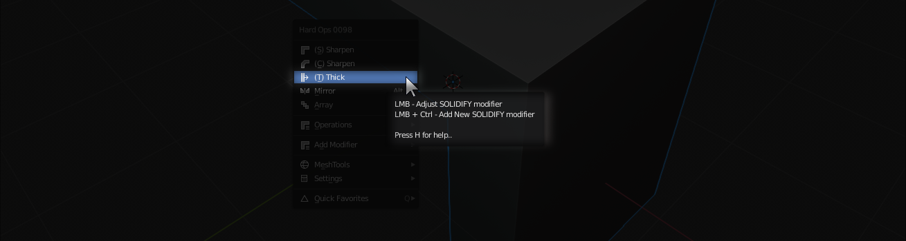
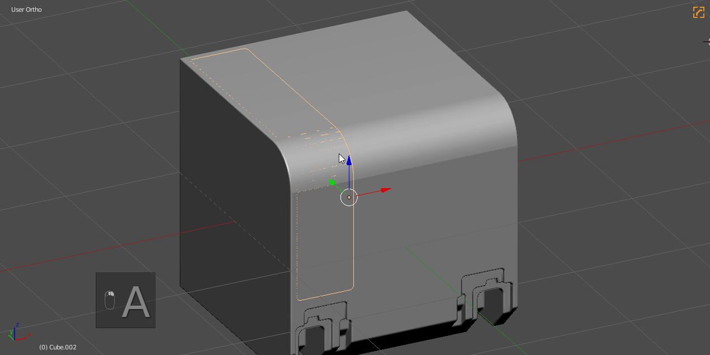
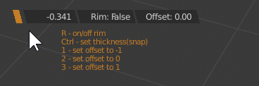
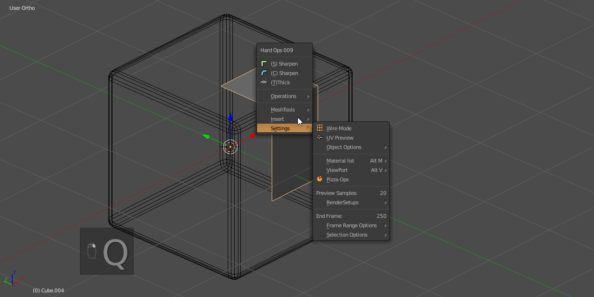
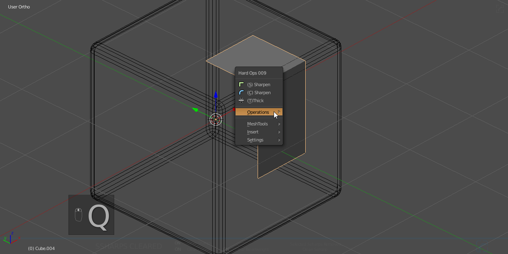

### tThick

# Accessing tThick

Tthick is an option on the main menu from pressing <kbd>Q</kbd>

## What is tThick?

Tthick is one of the modal operators in Hard Ops intended to use a solidify modifier in a modal manner. This tool is intended to behave as an object level extrude.

---

## tThick use case

If the mesh is undefined:

<kbd>Q</kbd> >> tThick

If the mesh is [csharp](csharpen.md) / [cstep](step.md):

<kbd>Q</kbd> >> [Operations](operations.md) >> tThick

In the above example I reset the [sstatus](sstatus.md) to undefined and used tthick to thicken the mesh. From there I was able to use the [boolean](boolean.md) hotkey to cut into the main mesh.

---

## tThick Detailed Usage

> When pressing <kbd>H</kbd> during a modal the help will be displayed.

When using tThick the following hotkeys apply:

  - <kbd>R</kbd> - turns on rim for solidify (useful for cases where the mesh needs to only look thick)
  - <kbd>1</kbd> - sets offset to 1. Makes mesh sit on top of itself.
  - <kbd>2</kbd> - sets offset to 0. This pushes the mesh in and out at the same time.
  - <kbd>3</kbd> - opposite of 1. Pushes mesh down itself.
  - <kbd>Ctrl</kbd> - changes offset manually. Rare usage.

Rim

  

Offset Example

---

## tThick tips

# tThick to panel cut

Having a pending boolean sets your mesh into what is called a [boolshape](sstatus.md). The icon in the corner will be green. 

This means the <kbd>Q</kbd> menu will have the boolshape menu of:

- bWidth
- tThick
- qArray

tThick has the interesting effect of turning a boolean into a panel cut.

