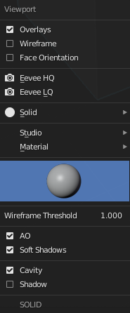
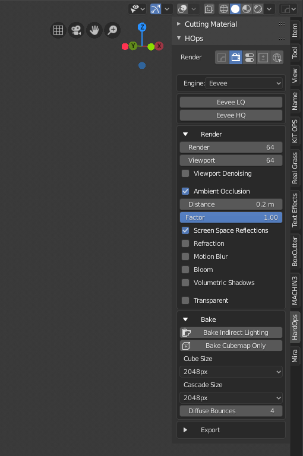
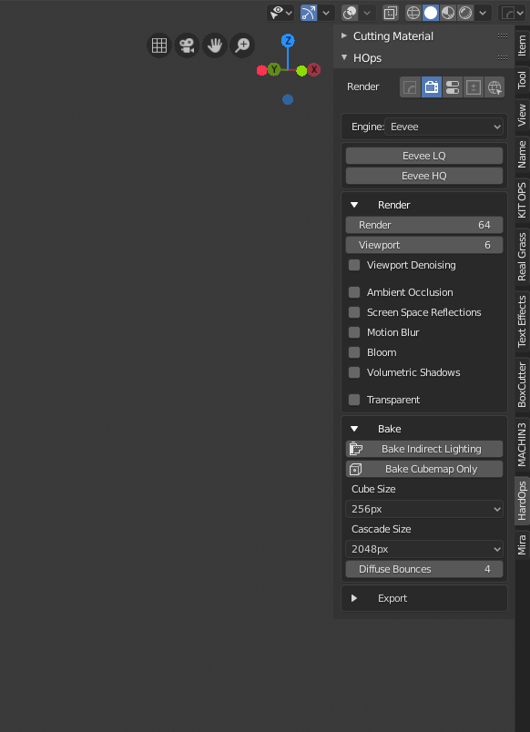
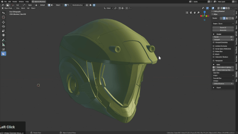

## [Viewport System](https://youtu.be/NGqRJ45UIVQ)

# Eevee support

In 2.8 we re-evaluated the idea for the [alt + V](hotkeys.md) submenu for 2.8.

Pressing it in the 3d view will bring up quick options for adjusting the viewport.

# Eevee HQ

This mode is intended to be for quality presentation for viewport screengrabs or presentations. We intend to expand this option to be more supportive in the future but at this time it sets the following settings.

Eevee HQ also enhanced the viewport via the options shown above. This can make the mesh look nicer on transitions than the way it looks by default.

# Eevee LQ

LQ will lower the setting with intentions on speeding up the performance and allowing you to work. These two in conjuctuion will allow you to toggle between speed and quality.

# Wireframe

Toggles wireframes on all visible objects.

# Face Orientation

This option is here for troubleshooting. In 2.8 they made normals harder to identify which can be weird with bevels (sometimes to great effect). But red is interpreted as bad. Usually you want a surface all blue.

Boolshapes will appear inverted with the surface but that is just a part of life so be aware of it.

