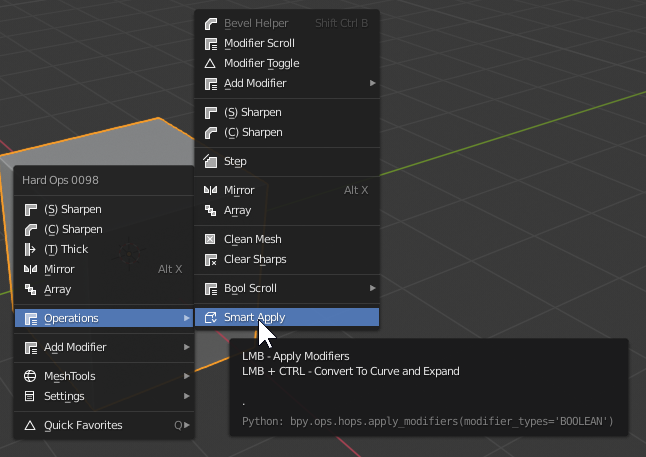
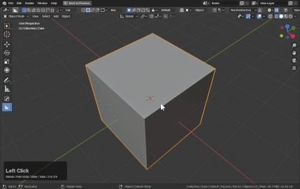
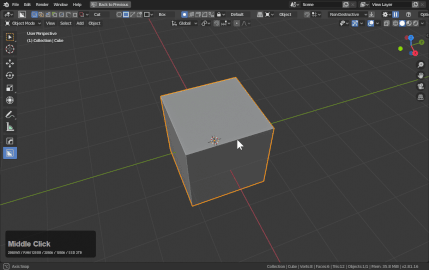

### Workflows and Solutions

# Creating Pipes Using Smart Apply

Smart Apply has the ctrl behavior or converting to a curve and setting expand as the operation.

To show this in action.

Alternatively users can convert a mesh to curve and use the Hard Ops Q options for adjustment.

Smart apply just makes it easier to pull off. By consolidating some of the keystrokes.

# Using Bwidth (3) to create spacer geometry

First I will use a cylinder with ctrl + shift + numpad minus to do an edit mode boolean operation.

While the edge I want to bevel is still selected, I will use Q >> Bwidth (ctrl) to add a bevel to the selection.

After applying and cleanup it is a little more manageable.

